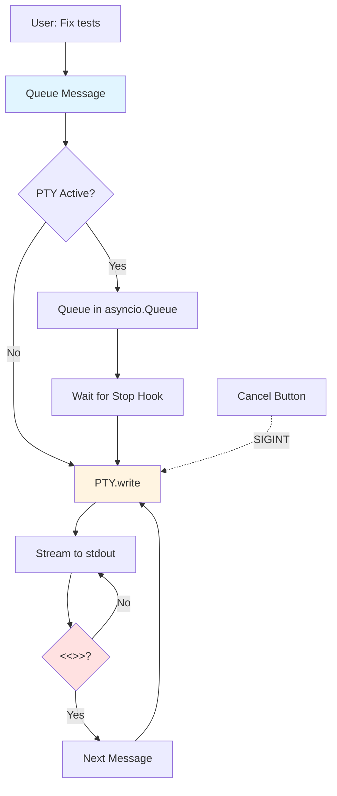
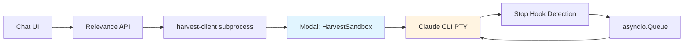

# Harvest PTY Interactive Sessions: Architecture Overview

**Goal:** Persistent Claude Code CLI sessions with message queuing for Relevance Chat UI
**Approach:** PTY-based interactive mode + Stop hook detection
**Decision Point:** Approve PTY architecture for Phase 1 implementation

---

## 1. Problem Statement

Current implementation uses one-shot Claude CLI calls that lose conversation context across prompts.

**Requirements:**
- Maintain conversation context across multiple user prompts in same session
- Queue messages while Claude is processing (don't drop user input)
- Stream output to Chat UI right pane (xterm.js terminal viewer)
- Support cancellation mid-execution (Ctrl+C)

**Constraint:** Must work with native Claude Code CLI - Anthropic policy blocks third-party OAuth wrappers, so we can't reimplement the protocol.

---

## 2. Architectural Solution

**Core Pattern:**
1. Spawn Claude CLI in PTY (persistent interactive session)
2. Configure Stop hook to emit `<<<CLAUDE_DONE>>>` marker when response completes
3. Queue user prompts via `asyncio.Queue`
4. Process messages sequentially:
   - Send prompt → `PTY.write()`
   - Stream output → `ConversationManager` → Right pane
   - Detect Stop hook → Process next queued message

**Key Insight:** This matches how Claude Code CLI *already* works natively. We're wrapping it, not reimplementing it. The Stop hook is a standard Claude CLI feature used for signaling completion.

**Session Model:** `conversation_id === session_id`
- One Modal sandbox per conversation
- Clean isolation (no cross-contamination)
- Simpler debugging and state management
- Modal scales horizontally (10-50 concurrent sandboxes is trivial)

---

## 3. Message Flow

**Flow explanation:**
- User messages queue while Claude is processing
- Each message waits for `<<<CLAUDE_DONE>>>` marker before sending next
- Cancel button sends SIGINT to PTY (graceful termination)
- All output streams to Chat UI right pane in real-time

---

## 4. Risk Mitigation

| Risk | Impact | Mitigation | Status |
|------|--------|------------|--------|
| **Memory leaks** (Claude CLI can leak tens of GBs) | High | 6GB container limit + 24hr session timeout + 5min idle timeout | ✅ Built-in safety |
| **Stop hook doesn't fire** | High | 30min timeout fallback (assume done if no marker) | ✅ Graceful degradation |
| **Modal cold starts** | Medium | Memory snapshots reduce to <3s | ✅ Acceptable UX |

**Cost optimization:** 5-minute idle timeout terminates containers (saves ~80% compute cost vs always-on). Session can run up to 24 hours for overnight tasks like "refactor entire auth system."

---

## 5. Implementation Phases

**Phase 1: PTY Infrastructure** (Harvest repo, 1 week)
- Add `PTYWrapper` class for bidirectional communication
- Implement Stop hook detection and message queue
- Add memory monitoring and idle timeout

**Phase 2: harvest-client Package** (3 days)
- Python subprocess wrapper for Relevance API consumption
- Thin client that streams to stdout

**Phase 3: Relevance Integration** (1 week)
- `BackgroundCoderPresetAgent` with `HarvestRuntime`
- Cancel endpoint for mid-execution termination
- Route through Relevance API (server-to-server, no CORS)

---

## 6. Decision Points

**What we need from you:**

1. ✅ **Approve PTY architecture?**
   Alternative: Custom polling protocol (more complexity, worse UX)

2. ✅ **Approve session model?**
   `conversation_id === session_id` (clean isolation vs sandbox pooling complexity)

3. ✅ **Approve timeout strategy?**
   5min idle, 24hr session max (supports overnight work, saves cost)

**Next step if approved:** Proceed with Phase 1 implementation (est. 1 week)

---

## System Architecture

---

## Critical Implementation Files

If approved, Phase 1 focuses on these 5 files:

1. **`packages/modal-executor/src/modal_executor/sandbox.py`**
   Core PTY infrastructure, message queue, Stop hook detection (~300 lines added)

2. **`packages/modal-executor/src/modal_executor/pty_wrapper.py`**
   NEW file for PTY read/write abstraction (~80 lines)

3. **`packages/modal-executor/src/modal_executor/app.py`**
   Add cancel endpoint + session registry (~50 lines)

4. **`packages/harvest-client/src/harvest_client/client.py`**
   NEW package, thin wrapper for external consumption (~100 lines)

5. **`apps/nodeapi/src/agent/preset_agents/background_coder/harvest_runtime.ts`**
   NEW file, spawn Python subprocess + stream to ConversationManager (~80 lines)

---

📄 **Full Technical Plan**: [plan_2026-01-17_1630.md](./plan_2026-01-17_1630.md) (1,025 lines with detailed implementation, code examples, testing strategy, and rollout plan)
