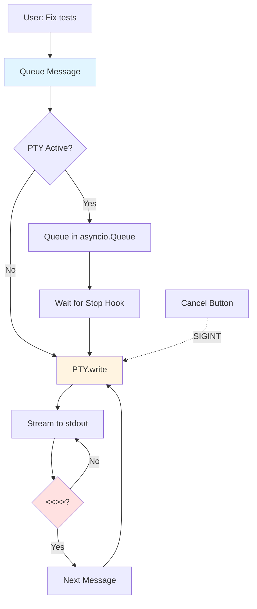
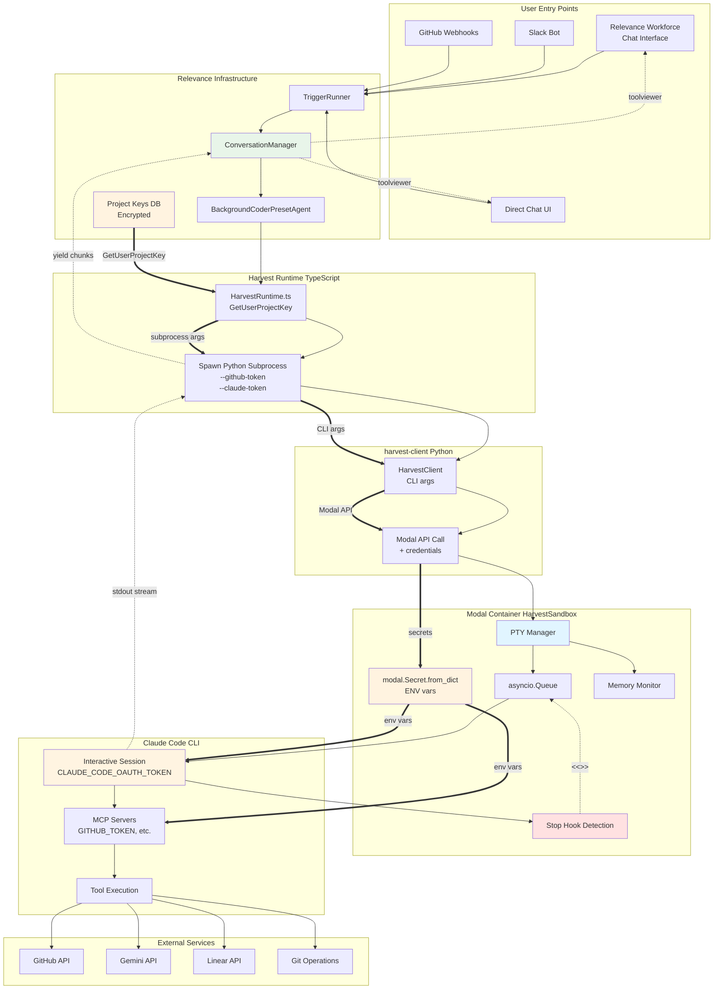
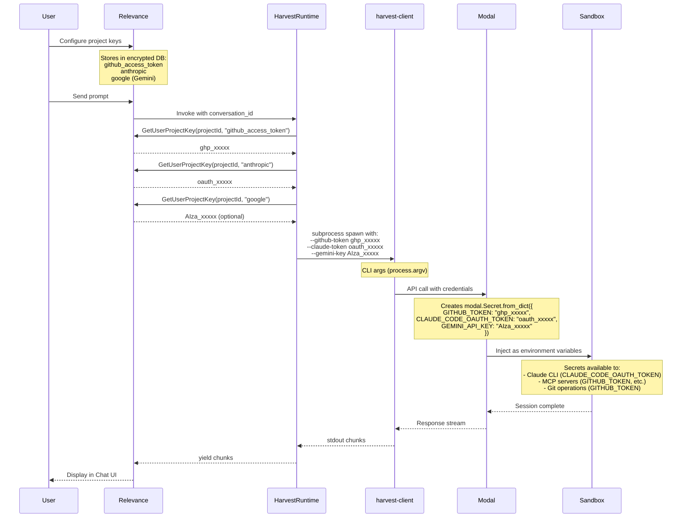

# Harvest PTY Interactive Sessions: Architecture Overview

**Goal:** Persistent Claude Code CLI sessions with message queuing for Relevance Chat UI
**Approach:** PTY-based interactive mode + Stop hook detection
**Decision Point:** Approve PTY architecture for Phase 1 implementation

---

## 1. Problem Statement

Current implementation uses one-shot Claude CLI calls that lose conversation context across prompts.

**Requirements:**
- Maintain conversation context across multiple user prompts in same session
- Queue messages while Claude is processing (don't drop user input)
- Stream output to Chat UI right pane (xterm.js terminal viewer)
- Support cancellation mid-execution (Ctrl+C)

**Constraint:** Must work with native Claude Code CLI - Anthropic policy blocks third-party OAuth wrappers, so we can't reimplement the protocol.

---

## 2. Architectural Solution

**Core Pattern:**
1. Spawn Claude CLI in PTY (persistent interactive session)
2. Configure Stop hook to emit `<<<CLAUDE_DONE>>>` marker when response completes
3. Queue user prompts via `asyncio.Queue`
4. Process messages sequentially:
   - Send prompt → `PTY.write()`
   - Stream output → `ConversationManager` → Right pane
   - Detect Stop hook → Process next queued message

**Key Insight:** This matches how Claude Code CLI *already* works natively. We're wrapping it, not reimplementing it. The Stop hook is a standard Claude CLI feature used for signaling completion.

**Session Model:** `conversation_id === session_id`
- One Modal sandbox per conversation
- Clean isolation (no cross-contamination)
- Simpler debugging and state management
- Modal scales horizontally (10-50 concurrent sandboxes is trivial)

---

## 3. Message Flow



**Flow explanation:**
- User messages queue while Claude is processing
- Each message waits for `<<<CLAUDE_DONE>>>` marker before sending next
- Cancel button sends SIGINT to PTY (graceful termination)
- All output streams to Chat UI right pane in real-time

---

## 4. Risk Mitigation

| Risk | Impact | Mitigation | Status |
|------|--------|------------|--------|
| **Memory leaks** (Claude CLI can leak tens of GBs) | High | 6GB container limit + 24hr session timeout + 5min idle timeout | ✅ Built-in safety |
| **Stop hook doesn't fire** | High | 30min timeout fallback (assume done if no marker) | ✅ Graceful degradation |
| **Modal cold starts** | Medium | Memory snapshots reduce to <3s | ✅ Acceptable UX |

**Cost optimization:** 5-minute idle timeout terminates containers (saves ~80% compute cost vs always-on). Session can run up to 24 hours for overnight tasks like "refactor entire auth system."

---

## 5. Implementation Phases

**Phase 1: PTY Infrastructure** (Harvest repo, 1 week)
- Add `PTYWrapper` class for bidirectional communication
- Implement Stop hook detection and message queue
- Add memory monitoring and idle timeout

**Phase 2: harvest-client Package** (3 days)
- Python subprocess wrapper for Relevance API consumption
- Thin client that streams to stdout

**Phase 3: Relevance Integration** (1 week)
- `BackgroundCoderPresetAgent` with `HarvestRuntime`
- Cancel endpoint for mid-execution termination
- Route through Relevance API (server-to-server, no CORS)

---

## 6. Decision Points

**What we need from you:**

1. ✅ **Approve PTY architecture?**
   Alternative: Custom polling protocol (more complexity, worse UX)

2. ✅ **Approve session model?**
   `conversation_id === session_id` (clean isolation vs sandbox pooling complexity)

3. ✅ **Approve timeout strategy?**
   5min idle, 24hr session max (supports overnight work, saves cost)

**Next step if approved:** Proceed with Phase 1 implementation (est. 1 week)

---

## Complete System Architecture

**End-to-end flow showing all components from user input to code execution, including secrets hand-off:**



**Architecture layers:**
- **User Entry Points**: Relevance Workforce (primary), direct Chat UI, Slack Bot, GitHub webhooks send user prompts
- **Relevance Infrastructure**: Routes messages, manages conversations, streams output to UI, **stores encrypted project keys**
- **Harvest Runtime**: TypeScript layer retrieves secrets via GetUserProjectKey, spawns Python subprocess with credentials
- **harvest-client**: Thin Python wrapper receives credentials as CLI args, calls Modal API
- **Modal Container**: Creates modal.Secret from credentials, injects as env vars, manages PTY/queue/hooks/memory
- **Claude CLI**: Interactive session uses CLAUDE_CODE_OAUTH_TOKEN, MCP servers use GITHUB_TOKEN/etc.
- **Bidirectional streaming**: Output flows back through all layers to Chat UI right pane

**Data flows:**
- **User prompts** (solid lines): Flow down from triggers → Relevance → TypeScript → Python → Modal → Claude CLI
- **Claude output** (dotted lines): Streams back up through all layers to Chat UI toolviewer
- **Secrets** (thick arrows `==>`): Retrieved from encrypted DB → subprocess args → Modal API → env vars → Claude/MCP
- **Stop hook** (red): `<<<CLAUDE_DONE>>>` marker signals completion, triggers next queued message

---

## Secrets & Credentials Hand-Off

**Security-critical flow showing how API keys and tokens flow from Relevance to Modal sandbox:**



**Credential mapping:**

| Harvest Requires | Relevance Has | Retrieval Method | Required? |
|---|---|---|---|
| `github_token` | `github_access_token` | `GetUserProjectKey(projectId, "github_access_token", false)` | ✅ Yes |
| `claude_oauth_token` | `anthropic` | `GetUserProjectKey(projectId, "anthropic", false)` | ✅ Yes |
| `gemini_api_key` | `google` | `GetUserProjectKey(projectId, "google", false)` | Optional |
| `sentry_auth_token` | - | To be added to project keys | Optional |
| `linear_api_key` | OAuth only | To be added to project keys | Optional |

**Security measures:**
- ✅ Secrets stored encrypted in Relevance database
- ✅ Retrieved per-request (no caching in application layer)
- ✅ Passed via process args (not environment variables in Node.js layer)
- ✅ Modal secrets isolated per sandbox (no cross-contamination)
- ✅ Secrets auto-destroyed when sandbox terminates
- ✅ No secrets logged or written to disk
- ⚠️ Process args visible in `ps` output (mitigated: Modal containers isolated, short-lived)

**Code reference (from Phase 3 implementation):**
```typescript
// apps/nodeapi/src/agent/preset_agents/background_coder/harvest_runtime.ts
export const HarvestRuntime = async (convo: ConversationManager) => {
  const projectId = convo.a.project as string;

  // Retrieve credentials
  const githubToken = await GetUserProjectKey(projectId, "github_access_token", false);
  const claudeToken = await GetUserProjectKey(projectId, "anthropic", false);
  const geminiKey = await GetUserProjectKey(projectId, "google", false);

  if (!githubToken || !claudeToken) {
    throw new Error("GitHub and Anthropic tokens required. Add to project secrets.");
  }

  // Spawn harvest-client with credentials
  const harvestProcess = spawn("python", [
    "-m", "harvest_client",
    "--session-id", conversationId,
    "--github-token", githubToken,
    "--claude-token", claudeToken,
    ...(geminiKey ? ["--gemini-key", geminiKey] : []),
  ]);

  // Stream output...
};
```

---

## Critical Implementation Files

If approved, Phase 1 focuses on these 5 files:

1. **`packages/modal-executor/src/modal_executor/sandbox.py`**
   Core PTY infrastructure, message queue, Stop hook detection (~300 lines added)

2. **`packages/modal-executor/src/modal_executor/pty_wrapper.py`**
   NEW file for PTY read/write abstraction (~80 lines)

3. **`packages/modal-executor/src/modal_executor/app.py`**
   Add cancel endpoint + session registry (~50 lines)

4. **`packages/harvest-client/src/harvest_client/client.py`**
   NEW package, thin wrapper for external consumption (~100 lines)

5. **`apps/nodeapi/src/agent/preset_agents/background_coder/harvest_runtime.ts`**
   NEW file, spawn Python subprocess + stream to ConversationManager (~80 lines)

---

📄 **Full Technical Plan**: [plan_2026-01-17_1630.md](./plan_2026-01-17_1630.md) (1,025 lines with detailed implementation, code examples, testing strategy, and rollout plan)
