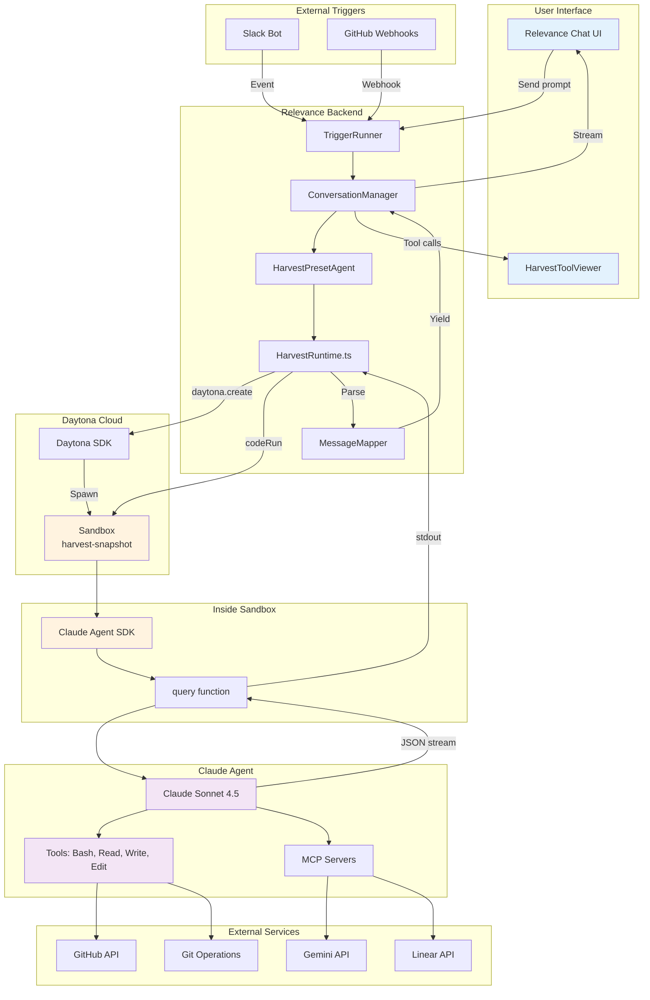

# Harvest

> Did you **Harvest** that? 🌾

Build your AI Workforce with Harvest - the background coding agent that tends to your repositories like farmers tending to crops, cultivating code that grows stronger while you sleep.

Harvest is a background coding agent service built on the architecture that powers [Ramp's Inspect](https://builders.ramp.com/post/why-we-built-our-background-agent), designed specifically for the **Relevance AI** ecosystem.

---

## Status at a Glance

| Component | Status | Documentation |
|-----------|--------|---------------|
| **Daytona Executor** | 🚧 MVP Ready | [`packages/daytona-executor/`](packages/daytona-executor/) |
| **Claude Agent SDK** | ✅ POC Validated | [`trials/daytona-sdk-poc/`](trials/daytona-sdk-poc/) |
| **Claude CLI Integration** | ✅ Ready | [`docs/ai/`](docs/ai/) |
| **Git Workflow** | ✅ Ready | [`docs/ai/shared/git-workflow.md`](docs/ai/shared/git-workflow.md) |
| **MCP Servers** | ✅ Ready | [MCP table](#mcp-servers) |
| **API Layer** | ⏳ Planned | [`docs/plans/IMPLEMENTATION_PLAN.md`](docs/plans/IMPLEMENTATION_PLAN.md) |
| **Slack/Web Client** | ⏳ Planned | [`docs/plans/IMPLEMENTATION_PLAN.md`](docs/plans/IMPLEMENTATION_PLAN.md) |

---

## Core Capabilities

- **Autonomous Development**: Works continuously across repositories without human intervention
- **Sandbox Orchestration**: Spins up isolated Daytona sandboxes for each session
- **Claude Code CLI Integration**: Leverages Anthropic's official Claude CLI with full tool access
- **Multi-Model Strategy**: Primary Claude Sonnet 4.5 + Gemini for plan validation
- **Session Continuity**: SQLite-backed conversation state persists across sandbox restarts
- **Continuous Harvesting**: Generates pull requests, fixes bugs, and improves code while you focus on other work

---

## System Architecture

**Architecture Status**: Daytona + Claude Agent SDK

**Current Phase**: MVP implementation - Docker snapshot image with pre-installed SDK and MCP servers

See [`packages/daytona-executor/ARCHITECTURE.md`](packages/daytona-executor/ARCHITECTURE.md) for detailed architecture diagrams.



### Key Architectural Decisions

- **Runtime**: Daytona sandboxes with Claude Agent SDK
- **Session Model**: SDK manages session continuity via `resume` parameter
- **Message Format**: Structured JSON stream from SDK
- **Config Strategy**: Baked into snapshot image, loaded at runtime via SDK's `systemPrompt`
- **Security**: Non-root `harvest` user, secrets injected via `envVars`

**Key benefits:**
- TypeScript end-to-end
- Structured message types
- Built-in session management and cost tracking
- Fast cold starts with pre-built snapshot

### Agent Modes

Harvest uses **shared base + mode-specific extensions** architecture:

**Local Development Mode** (Your machine):
- Interactive brainstorming for complex tasks
- Can pause for human feedback
- Human judgment available

**Autonomous Agent Mode** (Daytona sandbox):
- Maximum autonomy, no human in loop
- Execute without asking
- Fail forward pattern (try alternatives when blocked)

Both modes share execution rules (`docs/ai/shared/*.md`) but differ in intent/approach.

---

## MCP Servers

| Server | Package | Required Secret | Permissions | Where to Get |
|--------|---------|-----------------|-------------|--------------|
| **Memory** | `@modelcontextprotocol/server-memory` | None | - | - |
| **Filesystem** | `@modelcontextprotocol/server-filesystem` | None | - | - |
| **Playwright** | `@playwright/mcp` | None | - | - |
| **DevTools** | `chrome-devtools-mcp` | None | - | - |
| **GitHub** | `@modelcontextprotocol/server-github` | `GITHUB_TOKEN` | Contents: R/W, PRs: R/W, Issues: R/W | [github.com/settings/tokens](https://github.com/settings/tokens?type=beta) |
| **Linear** | `mcp-remote` → `https://mcp.linear.app/sse` | `LINEAR_API_KEY` | Full access | [linear.app/settings/api](https://linear.app/settings/api) |
| **Gemini** | `@houtini/gemini-mcp` | `GEMINI_API_KEY` | - | [aistudio.google.com/app/apikey](https://aistudio.google.com/app/apikey) |
| **Sentry** | `@sentry/mcp-server` | `SENTRY_AUTH_TOKEN` | project:read, event:read, issue:read | [sentry.io/settings/account/api/auth-tokens](https://sentry.io/settings/account/api/auth-tokens/) |

---

## Getting Started

### Quick Setup

```bash
git clone https://github.com/RelevanceAI/harvest.git
cd harvest
pnpm install
```

### Prerequisites

- Node.js 20+
- [pnpm](https://pnpm.io/) package manager
- Docker (for Daytona executor)
- GitHub account with PAT
- Claude Code CLI ([claude.ai/download](https://claude.ai/download))

> **Note:** Harvest previously used Modal Labs for cloud sandboxes. We transitioned to Daytona because Modal containers run as root, and the Claude Agent SDK blocks autonomous operation (`bypassPermissions`) with root privileges for security reasons. Daytona supports non-root containers, resolving this architectural constraint.

### Claude Code Setup

Enable Harvest AI rules and superpowers skills:

```bash
claude plugins add claude-plugins-official https://github.com/anthropics/claude-plugins-official
claude plugins install claude-plugins-official/superpowers
cp .claude/settings.json.template .claude/settings.json
```

Configure MCP servers in `~/.claude/mcp.json` - see [MCP table](#mcp-servers) for API keys and permissions.

### Testing & Code Quality

```bash
# Run validation scripts
pnpm run validate

# Test Daytona snapshot image (requires Docker)
pnpm run test:snapshot
```

---

## Documentation

| Directory | Purpose |
|-----------|---------|
| [`docs/plans/`](docs/plans/) | Implementation plans |
| [`docs/ai/`](docs/ai/) | AI agent rules and workflows |
| [`docs/mcp/`](docs/mcp/) | MCP server documentation |
| [`.claude/`](.claude/) | Project-level AI agent rules |

---

## Contributing

Use Claude, it knows everything it needs to know.

---

## License

[MIT](LICENSE)
