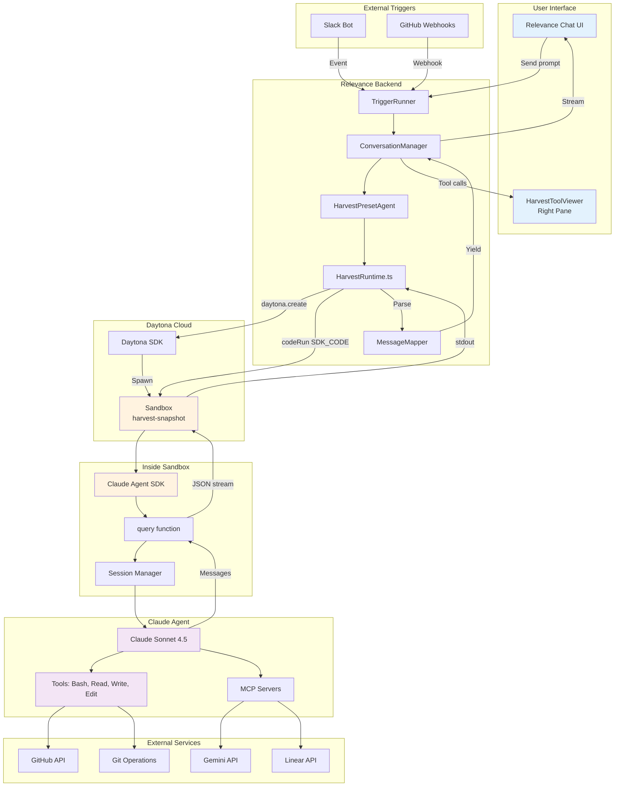
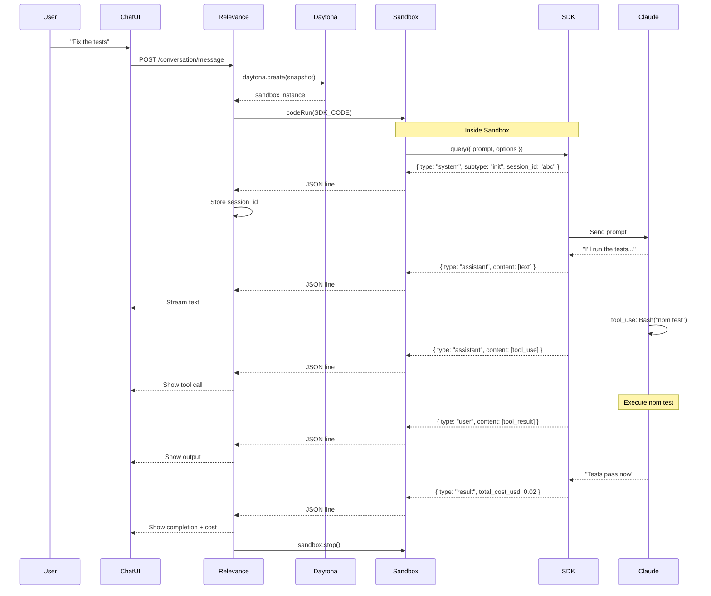
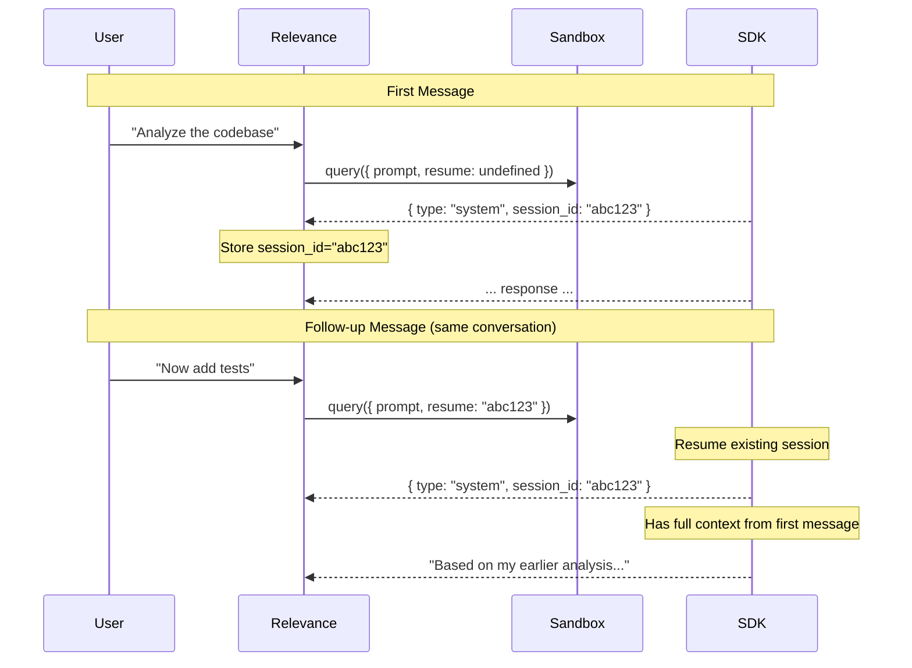
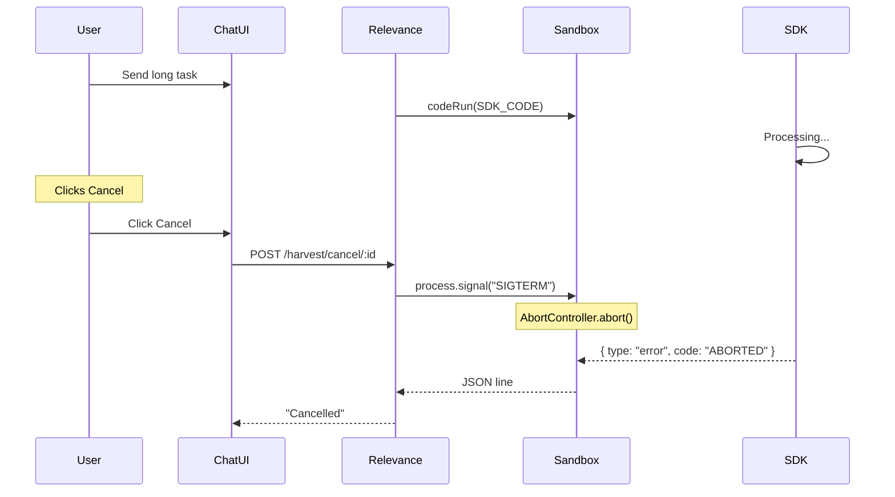
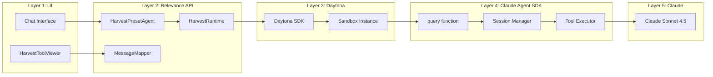
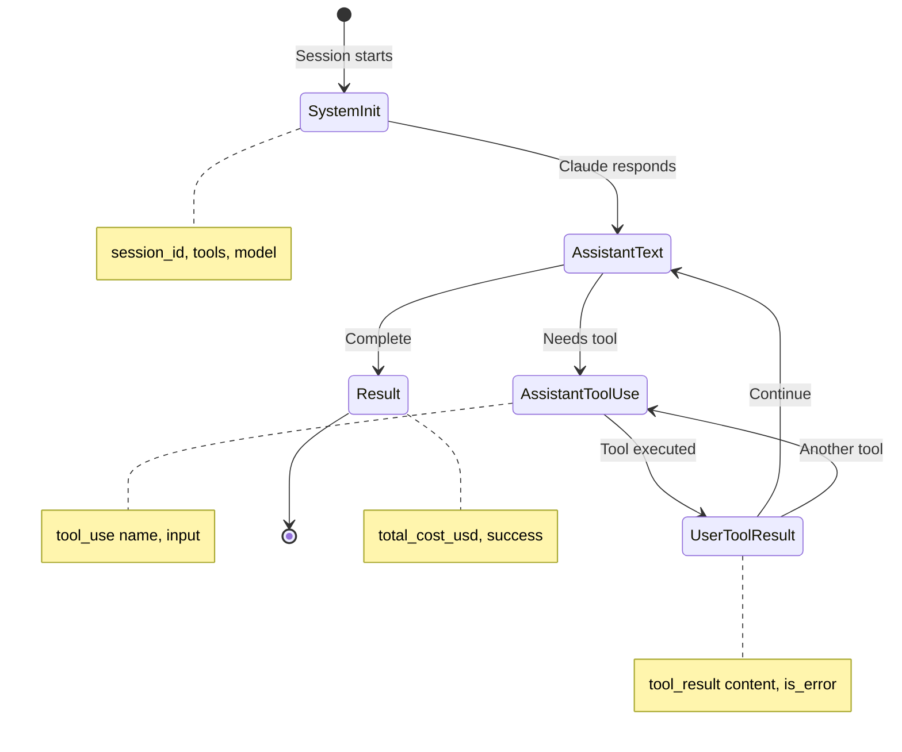
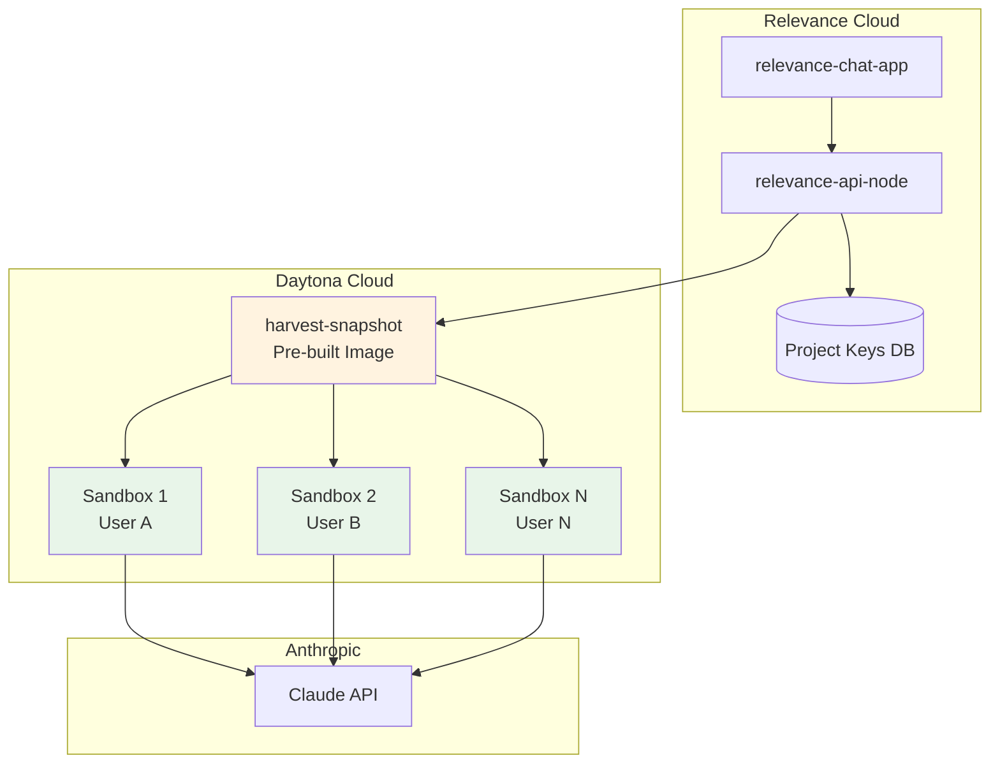
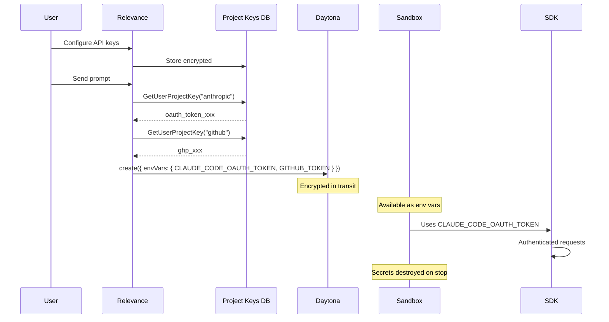
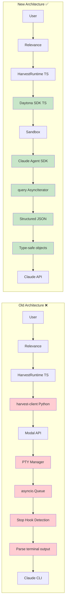

# Harvest Architecture: Daytona + Claude Agent SDK

## System Overview Diagram

---

## Message Flow Diagram

---

## Session Resume Flow

---

## Cancellation Flow

---

## Component Layers

---

## SDK Message Types

---

## Deployment Architecture

---

## Secrets Flow

---

## Key Advantages Over Old Architecture

**Eliminated complexity:**
- ❌ Python subprocess
- ❌ PTY management
- ❌ Stop hook parsing
- ❌ asyncio.Queue
- ❌ Terminal output parsing
- ❌ Root user workarounds

**Gained benefits:**
- ✅ TypeScript end-to-end
- ✅ Structured message types
- ✅ Built-in session management
- ✅ Built-in cost tracking
- ✅ Non-root execution
- ✅ Faster cold starts
